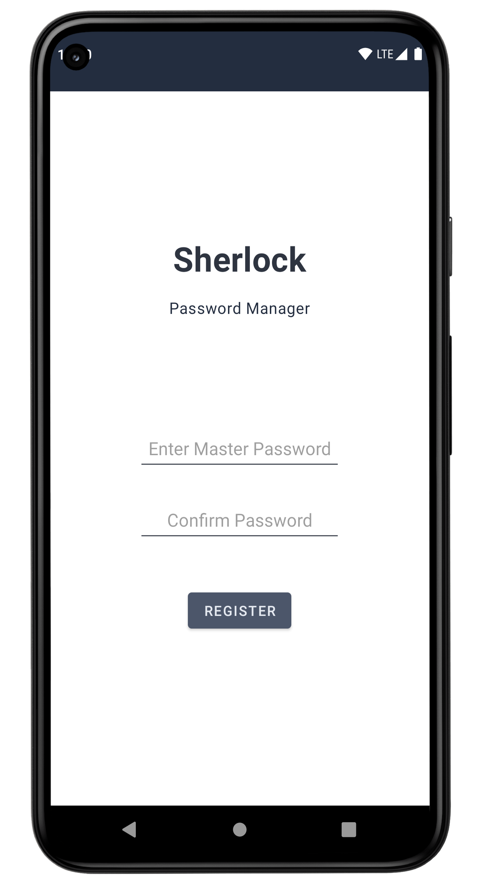
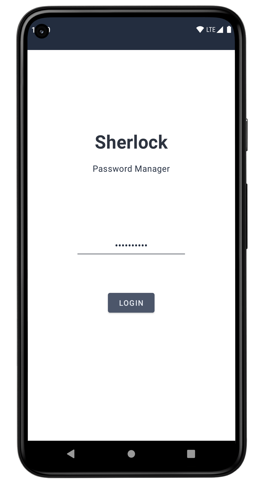
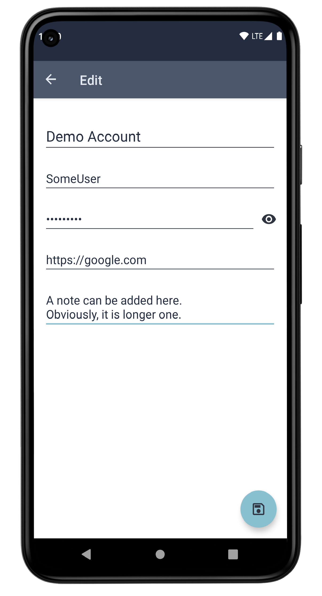
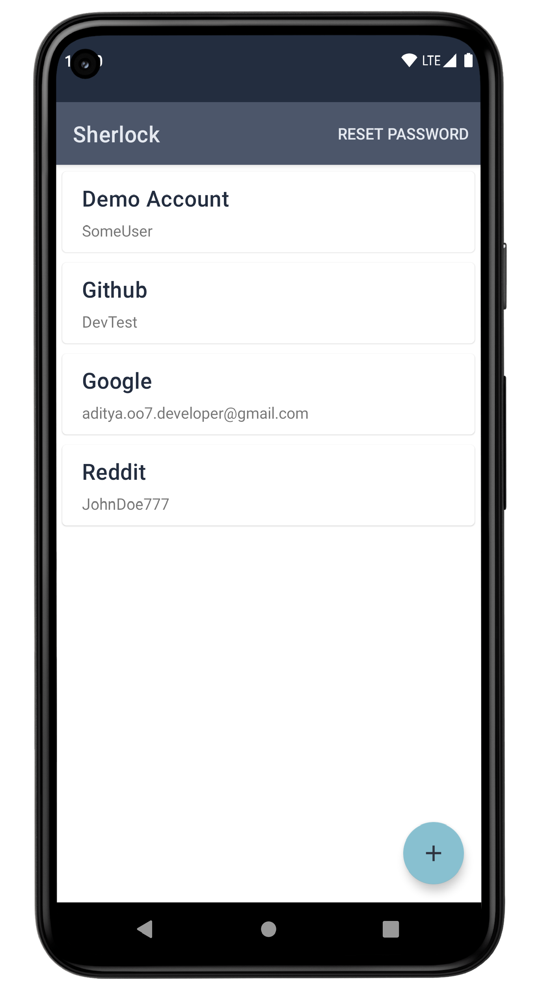
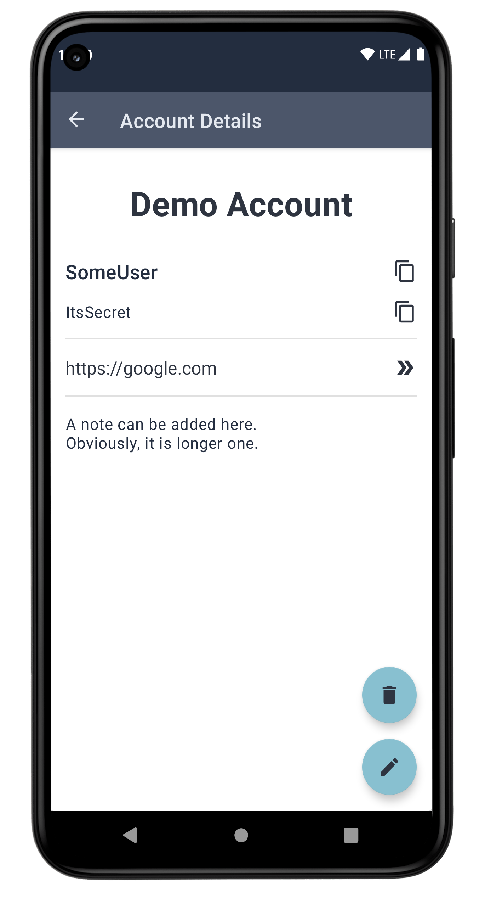
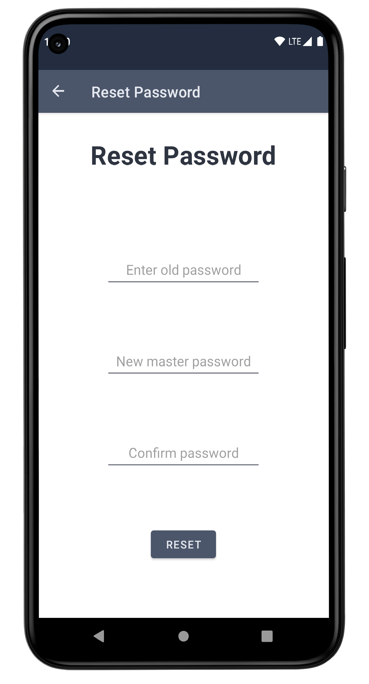

# Sherlock - The Password Manager

## About

Sherlock is the password manager android application. Sherlock uses **PBKDF2** key derivation function with **SHA512** encryption technique for authentication and secure data storage.

## Screenshots

<table>
  <tr>
    <td></td>
    <td></td>
    <td></td>
  </tr>
  <tr>
    <td></td>
    <td></td>
    <td></td>
  </tr>
</table>

## Built with

- Kotlin : First class and official programming language for Android development.
- Android Architecture Components :
  - LiveData : Data types that implement observer pattern.
  - ViewModel : Handles UI logic and helps to maintain state during configuration changes.
  - Room : SQLite persistance library.
- Coroutines : For asynchronous programming
- Navigation components : For better navigation handling.
- Espresso : UI testing framework.
- JUnit4 : Unit testing framework

## Developed with

- [MVVM](https://developer.android.com/jetpack/docs/guide#recommended-app-arch) architecture
- Clean architecture
- Test driven development
- Monolithic architecture

  

## Contribute

If you want to contribute to this app, you're always welcome!
See [Contributing Guidelines](CONTRIBUTING.md).